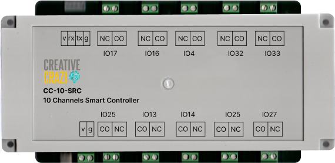
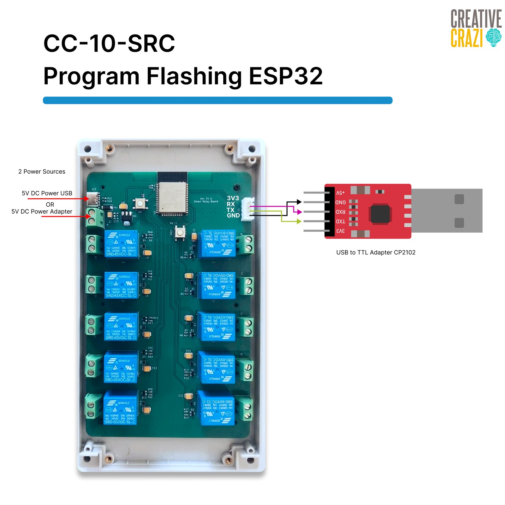

<div align="center">

# CC-10-SRC Firmware

**10-Channel Smart Relay Controller — ESP32**



<br><br>

### [⬇ &nbsp;Download Firmware](https://transtak-pte-ltd.github.io/CC-10-SRC-firmware/)

</div>

<br>

## Getting Started

**You will need:** a free [ThingsBoard account](https://thingsboard.cloud/signup) · DC 5V 1A power supply · USB-to-TTL adapter (CP2102)

**1 — Download** the latest firmware from the [download page](https://transtak-pte-ltd.github.io/CC-10-SRC-firmware/).

**2 — Connect** a USB-to-TTL adapter (CP2102) to the board's programming header (**3V3 · RX · TX · GND**) as shown below, and power the board with 5V DC (USB or adapter):

<div align="center">



</div>

**3 — Flash** the firmware to address `0x0` using the [Espressif Web Flasher](https://espressif.github.io/esptool-js/) (Chrome/Edge), or from the command line:

```
esptool.py --chip esp32 --baud 921600 write_flash 0x0 smart_relay_v1.0.bin
```

**4 — Configure** the board with ThingsBoard — watch the tutorial:

<div align="center">

[](https://www.youtube.com/watch?v=RWnBdYnZ4eA)

</div>

## Where to Buy

<div align="center">

<a href="https://creativecrazi.com/"></a>&nbsp;
<a href="https://shopee.sg/transtakpteltd"></a>&nbsp;
<a href="https://www.lazada.sg/shop/creative-crazi"></a>

</div>

---

> **Note:** If you need the source code, please [contact us](https://transtak.com.sg/contact/).

<div align="center">© Transtak Pte Ltd</div>
